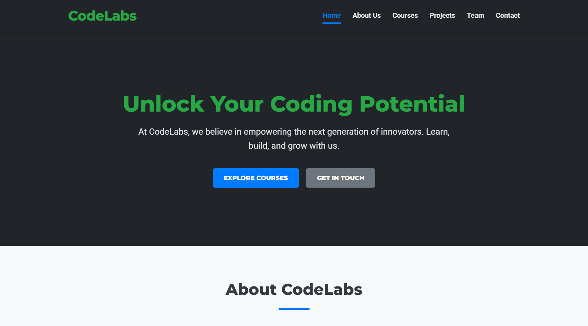

# CodeLabs (GoogleGemini) 

"CodeLabs" project is a sophisticated, modern web platform designed to serve as the digital hub for a premier coding education and community center. It aims to showcase CodeLabs' diverse course offerings, foster a vibrant learning community, highlight successful student projects, and provide a seamless touchpoint for prospective students and partne

## Live Project :  
https://AICOMp-sketch.github.io/CodeLabs/Source%20Code